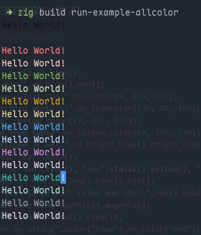

# Colored.zig

Colored.zig is a library for colored text in the terminal.   
Copy from [colored-rs](https://github.com/colored-rs/colored) with the only same api

# How to use 
``` zig
const colored = @import("colored");
var color = colored.ColoredString.from_str("hello world!");
_ = color.red().bold().on_brightblack();

std.debug.print("{f}\n", .{color});
std.log.info("{f}", .{color});
```


# Features 
* pure zig, easy to use, no dependencies
* just three files, easy to embedded
* works on Linux and Macos(true color), Windows is not guaranteed(because check env variables `COLORTERM` by `std.posix.getenv`)

## colors 
* black     brightblack
* red       brightred
* green     brightgreen
* yellow    brightyellow
* blue      brightblue
* magenta   brightmagenta
* cyan      brightcyan
* white     brightwhite

set fg color color_name()   
set bg color on_color_name()    

also support true color
`add_fgcolor()` and `add_bgcolor()`
* you can input `Color{.TrueColor = .{0x1f, 0x2f, 0x3f}}` 
* also, you can input `add_fgcolor(.Black)`, if your term support true color, it will automatically change to true color

## Styles
* bold
* dim
* underline
* blink
* reverse
* hidden
* strikethrough
* italic

