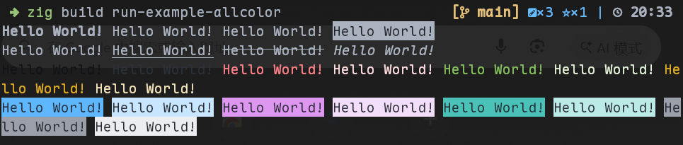

# Colored.zig

**Colored.zig** is a lightweight, dependency-free library for terminal text coloring in Zig.  

Inspired by [colored-rs](https://github.com/colored-rs/colored), it aims to provide the same intuitive chainable API for the Zig ecosystem.

## 🚀 Quick Start

```zig
const std = @import("std");
const colored = @import("colored");

pub fn main() !void {
    var text = colored.ColoredString.from_str("hello world!");
    
    // Use the chainable API to set styles and colors
    _ = text.red().bold().on_bright_black();

    // Print directly using standard formatters
    std.debug.print("{}\n", .{text});
    std.log.info("{}", .{text});
}

```

## ✨ Features

* **Pure Zig:** No external dependencies, easy to integrate.
* **Lightweight:** Consists of only three files; perfect for embedding in small projects.
* **Cross-Platform:** Confirmed support for Linux and macOS (TrueColor).
* *Note: Windows TrueColor support depends on the terminal environment and `COLORTERM` environment variable detection via `std.posix.getenv`.*


## 🎨 Supported Colors

| Base Colors | Bright Variants |
| --- | --- |
| `black()` | `bright_black()` |
| `red()` | `bright_red()` |
| `green()` | `bright_green()` |
| `yellow()` | `bright_yellow()` |
| `blue()` | `bright_blue()` |
| `magenta()` | `bright_magenta()` |
| `cyan()` | `bright_cyan()` |
| `white()` | `bright_white()` |

* **Foreground:** Use `color_name()` (e.g., `.red()`)
* **Background:** Use `on_color_name()` (e.g., `.on_red()`)

### 🌈 True Color Support

Advanced coloring can be achieved via `add_fgcolor()` and `add_bgcolor()`:

* **Manual RGB:** `add_fgcolor(.{ .TrueColor = .{ 0x1F, 0x2F, 0x3F } })`
* **Automatic Conversion:** If your terminal supports TrueColor, calling `add_fgcolor(.Black)` can automatically upgrade to the predefined TrueColor palette for better visual consistency.
* **Hex Support:** Parse colors from strings using `Color.from_str("#RRGGBB")`.

## 🎭 Styles

Enhance your text with standard ANSI styles:

* `bold()`
* `dim()`
* `italic()`
* `underline()`
* `blink()`
* `reverse()`
* `hidden()`
* `strikethrough()`

---

`Windows is not guaranteed`,
> [!NOTE]
> Windows 10+ users can usually enable ANSI support by using a modern terminal like **Windows Terminal** or by enabling Virtual Terminal Processing in their application.
